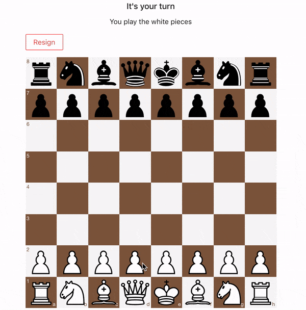

# Multiplayer Chess ♟

> “Of chess, it has been said that life is not long enough for it, but that is the fault of life, not chess.” – William Napier

**Play it [here](https://chess.andreiushakov.com/)**.

## About

Online multiplayer chess built with React, Express.js, Socket.io and PostgreSQL. Players can create a new game or join an existing one. No sign-up or login needed.

## How It Works

1. One player creates the game and shares the game code with the other player. The server adds the game to the database while making the creator of the game play the white pieces.
2. Other player joins the game by typing in the game code. The server verifies that such game exists. If it does, then the server sends the approval to join the game.
3. Players start the game. Each time a move is made it is recorded on the server and sent to the other player. The current board state is saved to the database on each move.
4. If any of the players get disconnected or if the server goes down, the players can rejoin by typing the game code and joining. The board state is pulled from the database.
5. If any of the players resigns from the game it is deleted from the database permanently and both of the players get kicked out of the game.

## Running the app

The app is already running here: https://chess.andreiushakov.com/. If you want to run it locally follow these steps:
_Note: If you run the app locally you will only be able to play on your local area network unless further configuration is made (not covered here.)_

**1. Run the server**

1.  From your terminal `cd` into the server directory and run `npm install`.
2.  Install and run PostgreSQL if you haven't already. Create chess database.
3.  Create a .env file in the root of server directory and declare PORT and DATABASE_URL. For PORT you can use 9000 and for DATABASE_URL postgres://{username}@localhost:5432/chess where username is the username you use to login into your machine.
4.  From your terminal run `npm start`.

**2. Run the client**

1.  From your terminal `cd` into the client directory and run `npm install`.
2.  From your terminal run `npm start`.
